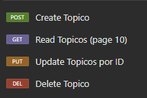
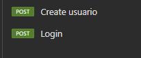
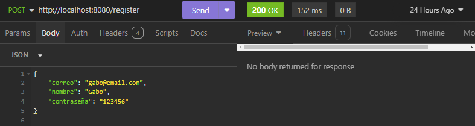
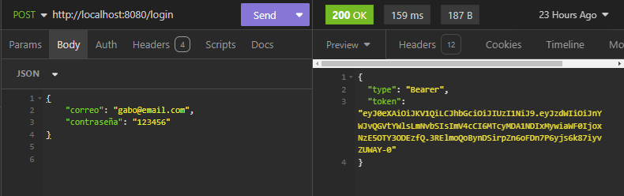
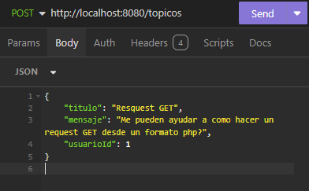
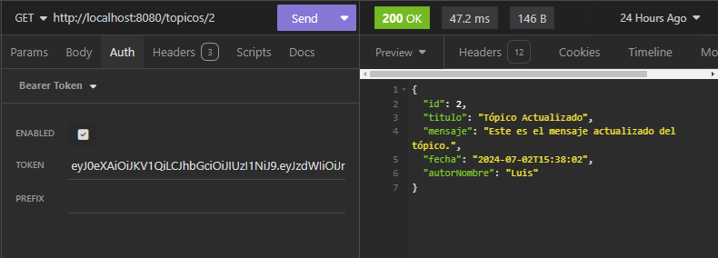
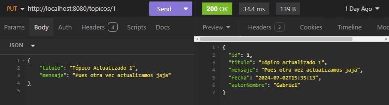
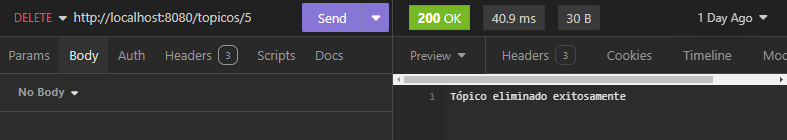

# ForoHub

#### Challenge de ONE para la creación de una API REST usando Spring como base de un foro web.

##### El desafío consiste en desarrollar una API RESTful que sirva como backend para un foro web. Esta API permitirá a los usuarios realizar operaciones CRUD (Crear, Leer, Actualizar, Eliminar) en los tópicos del foro. La seguridad y la autenticación se gestionarán mediante tokens JWT.

### Tecnologías Utilizadas
- Java 17
- Spring Boot
    - Spring Web
    - Spring Security
    - Spring Data JPA
    - Flyway Migration
    - Spring Boot DevTools
    - Lombok
- JWT (JSON Web Token)
- MySQL
- Maven

## Configuración

#### Al ser necesario Java Development Kit (JDK) 11 o superior al igual que Maven, como recomendación podrías abrir el proyecto desde un IDE Java como lo es IntelliJ IDEA o Eclipse.

#### De igual forma para la BD esta pensado con MySQL, se recomienda la utilización de un gestor como Workbench.
#### En este caso es necesario crear una Base de Datos con el nombre que gustes, ejemplo 'forohub'. Una vez creada deberás ir al archivo `application.properties` y actualizar el archivo con tus credenciales de Base de Datos:
`spring.datasource.url=jdbc:postgresql://localhost:3306/tu_base_de_datos`
`spring.datasource.username=tu_usuario`
`spring.datasource.password=tu_contraseña`
#### La seguridad de la API se gestiona mediante tokens JWT. Los usuarios deben autenticarse utilizando el endpoint de inicio de sesión para obtener un token JWT, que luego se utilizará para autenticar las solicitudes posteriores.
#### De igual forma se requiere de una autenticación por medio de JWT para realizar las peticiones. Por ende en el mismo archivo debes de modificar estas lineas a tu gusto para el cifrado:
`jwt.secret=tuSecretKey`
`jwt.expiration=86400000  # 1 día en milisegundos`

## Funcionamiento

##### Esta API principalmente tiene la posibilidad de hacer un CRUD para los tópicos de un foro. Las cuales son:

##### Adicional a estas peticiones, podemos crear un usuario y hacer un login con las credenciales registradas.

##### Esto con la finalidad de poder acceder mediante un token al funconamiento de las peticiones del foro.

## Ejemplo de uso

#### Aqui te dejó un ejemplo usando el software de INSOMNIA de muestra de como sería el funcionamiento de las peticiones una vez configurado el proyecto y arrancado de manera local (Las direcciones pueden cambiar respecto a donde estas desplegando el proyecto).

##### Primeramente se debe hacer una petición POST donde mandes en un formato JSON un nombre, correo y contraseña que serán las credenciales para hacer login.

##### Consecuente podrás hacer una petición POST al login, con el correo y contraseña de algun usuario registrado. Como respuesta obtendras un token, este te servirá para poder adjuntarlo a las peticiones de CRUD y de esta forma tener acceso a estas.

##### Ya una vez con acceso podrías hacer un CRUD completo de topicos de un foro web. 
##### Iniciando con crear alguno, mandando un request POST a `/topicos` con un formato JSON que incluyan un titulo, un mensaje y el id de la persona que quieras que este relacionada a ese tópico, validando que no sea posible repetirlo si ya existe uno igual. Por ejemplo:

##### Pasamos a listar los topicos teniendo dos opciones, una peticion en la cual vamos a poder listar topicos de manera paginada por un valor de 10, unicamente hacemos un GET a `/topicos`. La otra petición nos permite mostrar un tópico por su ID, igualmente haciendo un GET pero ahora agregando el valor del ID `/topicos/id`.Por ejemplo: 

##### Continuando con las funciones, el update, puedes modificar el titulo y mensaje de un tópico mediante su ID. Haciendo una petición PUT a `/topicos/id` igualmente dando el valor del ID del tópico a modificar, mandando en formato JSON la nueva información, validando que no sea posible repetirlo si ya existe uno igual. Por ejemplo:

##### Finalmente la eliminación de un tópico, igualmente es mediante un ID, haciendo una petición DELETE la cual debe llevar ese ID correspondiendo, `/tipicos/id`. Por ejemplo:
